<p align="center">
 <h2 align="center">Just Weather Scoring: Efficient End-to-End Nowcasting with Distributional Diffusion</h2>
 <p align="center">
 <b>
 Jannik Wiese<sup>*</sup> · Johannes Schusterbauer<sup>*</sup> · Tommaso Martorella · Björn Ommer
 </b>
 <p align="center"> 
    CompVis Group @ LMU Munich, Munich Center for Machine Learning (MCML)
 </p>
</p>
 </p>
<div align="center">

[](https://compvis.github.io/jws/)
[](_blank)
[](_blank)

<p align="center">
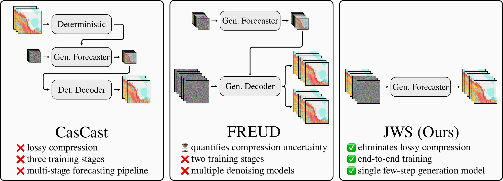
</p>
</div>

Official code for the paper "Just Weather Scoring: Efficient End-to-End Nowcasting with Distributional Diffusion".

## 💡 TL;DR

- **Just Weather Scoring (JWS)** generates probabilistic precipitation nowcasts directly in radar space with a **single, end-to-end diffusion model**.
- **Masked Asynchronous Diffusion (MAD)** preserves clean observations while adapting noise levels to high-dimensional radar sequences.
- A **simple distributional objective (sDDM)** combines CRPS and squared error for **few-step forecasting** with strong probabilistic skill and further gains from more inference steps.

## 📝 Overview

<p align="center">
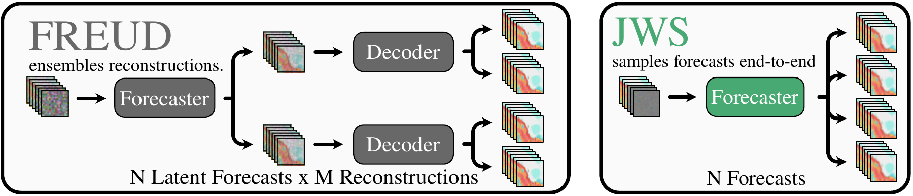
</p>

JWS forecasts radar sequences directly, eliminating separately trained autoencoders, reconstruction uncertainty from lossy compression, and the need for a deterministic forecasting stage.

<p align="center">
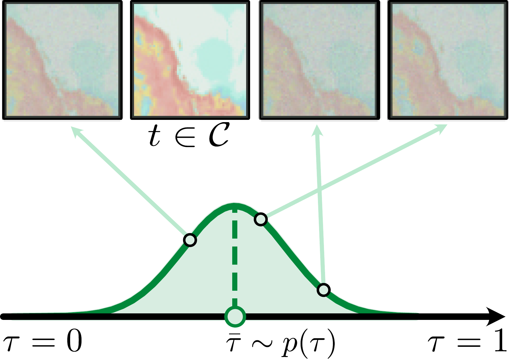
</p>

**Masked Asynchronous Diffusion (MAD)** keeps selected context frames clean and samples correlated noise levels for the remaining frames around a shared sequence-level center.
Dimensionality-aware timestep shifting adapts corruption to both spatial resolution and sequence length.
This aligns training with forecasting while preserving flexible conditioning, including temporal infilling and framewise confidence in observations or forecast priors.

<p align="center">
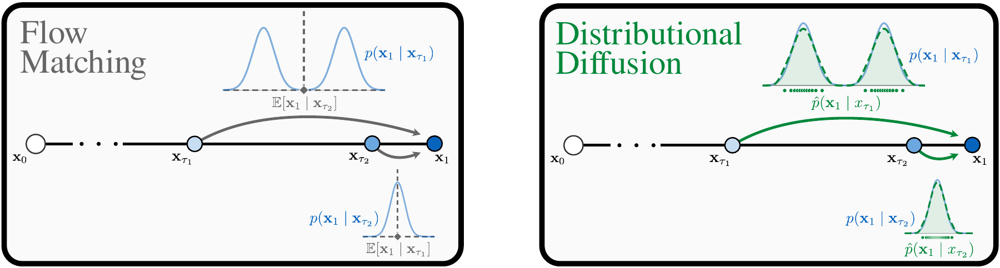
</p>

Our **simple Distributional Diffusion Models (sDDM)** objective linearly interpolates between the Continuous Ranked Probability Score (CRPS) at high noise and mean squared error near clean data.
CRPS supervises the conditional distribution at each pixel, while the increasing regression weight supports refinement as denoising progresses.

## 📊 Results

### State-of-the-art nowcasting

JWS-L/32 achieves the **best CRPS and SSIM** among the compared methods on the SEVIR and MeteoNet without classifier-free guidance.
Guidance further improves HSS and CSI, yielding the best HSS on SEVIR and the best HSS and CSI on MeteoNet.
Even JWS-T/32, with only **9M parameters**, outperforms the compared prior methods in CRPS on MeteoNet.

| | +20 min | +40 min | +60 min |
| :--- | :---: | :---: | :---: |
| **JWS** | 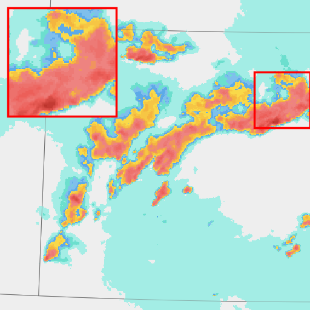 | 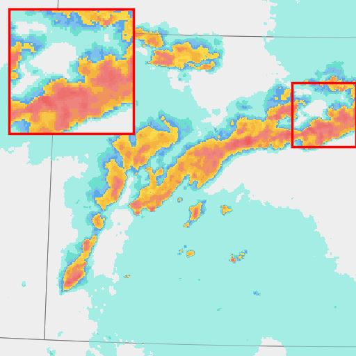 | 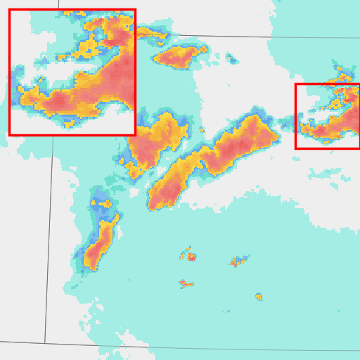 |
| **Ground truth** | 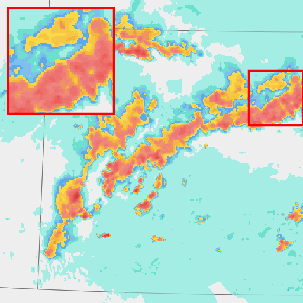 | 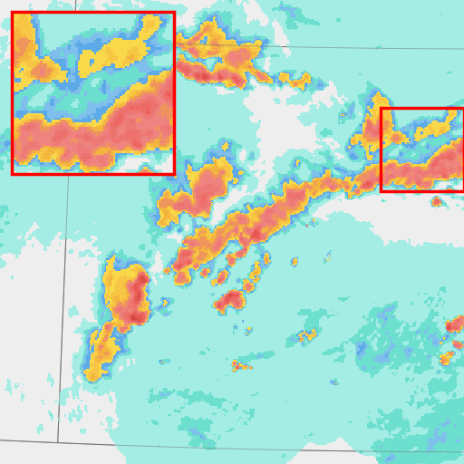 | 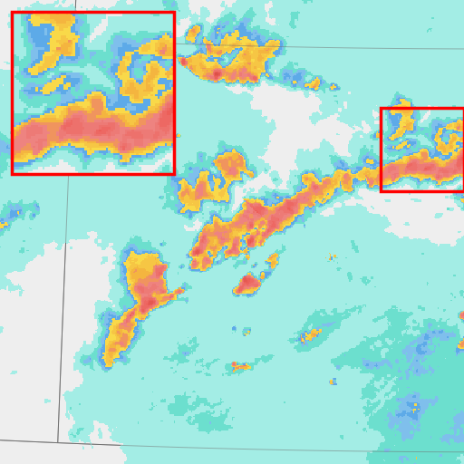 |

One SEVIR forecast from the paper's qualitative comparison. JWS preserves sharp precipitation structures over the one-hour forecast horizon; ensemble members represent different plausible evolutions.

### Efficiency

<p align="center">
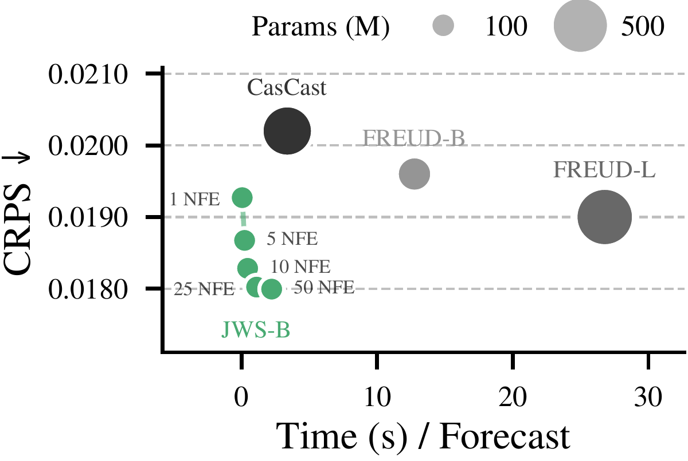
</p>

JWS devotes computation directly to generative forecasting, removing separate compression and decoding stages.
**One-step JWS-B generates 10 members in less than a second**, with competitive CRPS against CasCast and FREUD.
Additional denoising steps and larger ensembles provide further improvements when more inference compute is available.

### Improved Calibration

<p align="center">
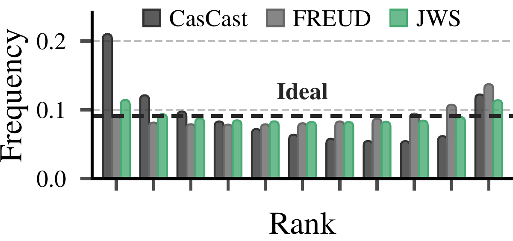
</p>

JWS produces **flatter rank histograms** on SEVIR compared with CasCast and FREUD.
JWS-T/32 achieves a **reliability index (RI) of 0.0949**, compared with **0.1355 for FREUD** and **0.3124 for CasCast**; lower is better.
Forecast ensembles retain coherent large-scale structure while varying locally, with ensemble variance concentrated in regions of high precipitation intensity.

## ⚙️ Usage

**Code and weights will be released soon!**

## 🎓 Citation

If you use our work or parts thereof, please cite us accordingly: 


```bibtex
@misc{wiese2026jws,
    title = {Just Weather Scoring: Efficient End-to-End Nowcasting with Distributional Diffusion},
    author = {Wiese, Jannik and Schusterbauer, Johannes and Martorella, Tommaso and Ommer, Bj{\"o}rn},
    year = {2026}
}
```
